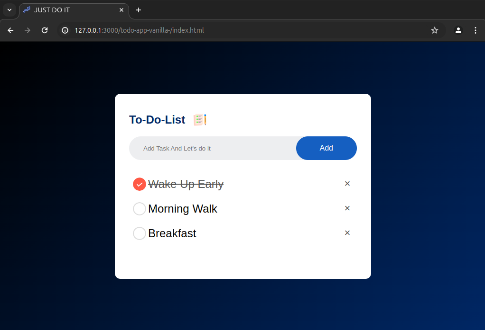

# Todo-app-vanilla-
A todo-app using simple html, css and JS (vanilla)
# Features
* You can add tasks and remove by clicking on cross
* The local host keeps the storage of tasks lists
* On reopening the browser or again running the live server, the tasks will be there.
* You can click on tasks to check the completed tasks 
* Reclicking the task will uncheck it
   