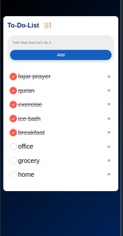

# Todo-app-vanilla-
A todo-app using simple html, css and JS (vanilla)
# Features
* You can add tasks by clicking on add or presssing enter (if on laptop)
* Plus you can remove the task by clicking on cross
* The local host keeps the storage of tasks lists
* On reopening the browser or again running the live server, the tasks will be there.
* You can click on tasks to check the completed tasks 
* Reclicking the task will uncheck it
* Resposnive for all devices (mobiles,tabs and PCs browsers)
# Perks
* Doesn't require any signup/login
* You can use vercel link to organize your tasks
* Nobody knows your routine xD
# On PC web browsers

# On Mobile

